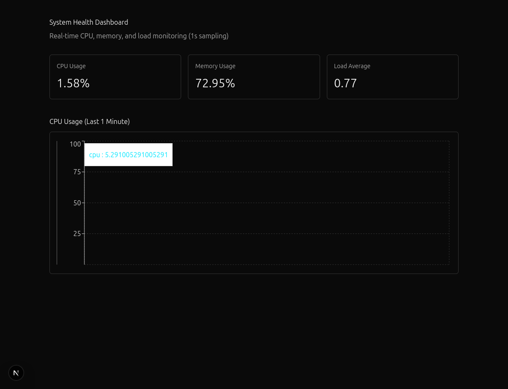

# System Monitor & Health Dashboard


A Linux-based system monitoring tool that collects CPU, memory, and load metrics, stores recent history, triggers alerts, and visualizes system health in real time.


## Demo



## Why this project?

This project was built to demonstrate:
- Operating Systems fundamentals
- Linux system metrics (/proc, CPU scheduling)
- Backend system design
- Thoughtful trade-offs (polling vs push, in-memory vs persistent storage)
- Practical Docker usage

---

## Architecture Overview

OS (Linux)
↓
Metric Collector (Node.js)
↓
Rolling In-Memory Storage
↓
REST API
↓
Dashboard (Next.js)

---

## Metrics Collection

- CPU usage is calculated using **delta-based sampling**
- Memory usage is derived from total vs free memory
- Load average reflects runnable and waiting processes

Metrics are collected **once per second** using a polling model.

---

## Why Polling?

Polling was chosen because:
- Linux exposes metrics as state, not events
- Predictable overhead
- Simpler failure handling

Push-based systems are more suitable at large scale.

---

## Historical Storage

Metrics are stored using **fixed-size rolling windows**:
- Last 1 minute
- Last 5 minutes
- Last 1 hour

This ensures:
- Constant memory usage
- No unbounded growth

---

## Alerting

An alert is triggered if:
- CPU usage exceeds 80%
- Sustained for 60 consecutive seconds

This avoids false positives from short spikes.

---

## Docker

The backend runs inside a Docker container.

Why Docker?
- Lightweight compared to virtual machines
- Shared Linux kernel
- Consistent runtime environment

---

## Running Locally

### Backend
```bash
npm install
node server.js
